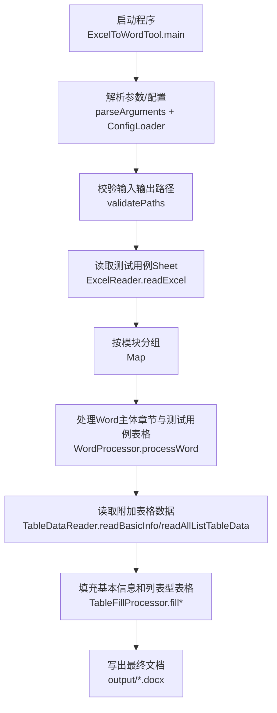

# Excel数据驱动Word文档自动生成工具

## ✅ 项目完成度评估（2026-03-30）

基于当前源码结构、现有测试和可运行结果，本项目整体已达到**可用交付状态（约85%）**，其中核心主链路（Excel→Word）已经打通。

### 已完成能力（可直接使用）

- ✅ 命令行入口与配置文件加载（`ExcelToWordTool` + `ConfigLoader`）
- ✅ 测试用例Sheet自动识别并按模块分组读取（`ExcelReader`）
- ✅ Word章节扫描、子章节创建、测试用例表格填充（`WordProcessor`）
- ✅ 基本信息表与列表型表自动匹配和填充（`TableDataReader` + `TableFillProcessor`）
- ✅ 需求分解、需求树、追溯矩阵、覆盖率计算（`RequirementManager` + `TraceabilityManager`）
- ✅ 示例程序与测试可运行（`mvn test` 通过）

### 待继续完善（不影响当前主流程可用）

- ⚠️ `WordProcessor` 与 `TableFillProcessor` 以集成行为为主，缺少细粒度单元测试
- ⚠️ 错误提示以控制台输出为主，缺少结构化日志与分级错误码
- ⚠️ 仅支持 `.xlsx/.docx`，不支持 `.xls/.doc`

## 📖 项目简介

本工具是一个基于Excel数据自动填充Word文档的工具，支持：

- ✅ **测试用例表格自动生成**：根据Excel数据自动在Word文档中生成测试用例表格
- ✅ **基本信息表格填充**：自动填充Word文档中的基本信息表格（如软件基本信息）
- ✅ **列表型表格填充**：自动填充各种列表型表格（如接口信息、测试环境等）
- ✅ **智能Sheet识别**：根据Excel内容自动识别Sheet类型，无需固定命名
- ✅ **格式自适应**：自动提取并应用Word模板的格式

## 🔄 处理流程图（端到端）



## 🚀 快速开始

### 系统要求

- JDK 8 及以上
- Maven 3.6 及以上（用于构建）
- Word 2016及以上（.docx格式）
- Excel 2016及以上（.xlsx格式）

### 构建项目

```bash
mvn clean package
```

构建完成后，在 `target` 目录下会生成 `DocAutoGenByExcel-0.0.1-SNAPSHOT.jar` 文件。

### 运行示例

```bash
java -jar target/DocAutoGenByExcel-0.0.1-SNAPSHOT.jar \
  -excel "test_data.xlsx" \
  -word "template.docx" \
  -out "output"
```

## 📋 Excel数据格式

### 1. 测试用例Sheet

**识别规则**：包含 `模块编号` 列的Sheet（Sheet名称可任意）

**格式示例**：

| 模块编号 | 测试项名称 | 标识 | 测试内容 | 测试策略与方法 | 判定准则 | 测试终止条件 | 追踪关系 |
|---------|-----------|------|---------|--------------|---------|------------|---------|
| 5.2 | 登录功能 | F001 | 验证用户登录功能 | 1) 输入正确的用户名和密码 | 正常登录应跳转到首页 | 测试用例执行完成 | 需求文档V1.0 |
| 5.2 | 注册功能 | F002 | 验证用户注册功能 | 1) 输入有效的邮箱和密码 | 正常注册应创建账户 | 测试用例执行完成 | 需求文档V1.0 |
| 5.3 | 密码重置 | F003 | 验证用户密码重置功能 | 1) 输入已注册的邮箱 | 应发送包含重置链接的邮件 | 测试用例执行完成 | 需求文档V1.0 |

**说明**：
- `模块编号` 列是必填的，用于标识数据属于哪个章节（如 `5.2`、`5.3`）
- 其他列名可以自定义，所有列的数据都会被填充到Word表格中
- 同一模块编号的多行数据会生成多个子章节（如 `5.2.1`、`5.2.2`）

### 2. 基本信息Sheet

**识别规则**：列结构为 `表格名称 | 字段名 | 字段值` 的Sheet（Sheet名称可任意）

**格式示例**：

| 表格名称 | 字段名 | 字段值 |
|---------|--------|--------|
| 表1.1 被测软件基本信息 | 软件等级 | D |
| 表1.1 被测软件基本信息 | 类型 | 嵌入式 |
| 表1.1 被测软件基本信息 | 行数 | 15000 |
| 表1.1 被测软件基本信息 | 中断源 | 3 |

**说明**：
- `表格名称` 必须与Word文档中表格的Caption（表格标题）完全匹配
- 程序会自动在Word文档中查找对应Caption的表格并填充数据

### 3. 列表型Sheet

**识别规则**：第一列为 `表格名称`，后续列为数据列的Sheet（Sheet名称可任意）

**格式示例**：

| 表格名称 | 序号 | 接口类型 | 方向（被测件而言） | 说明 |
|---------|------|---------|------------------|------|
| 表1.2 被测软件接口信息 | 1 | RS485串口 | 输入 | 接收控制指令 |
| 表1.2 被测软件接口信息 | 2 | 以太网 | 输出 | 发送状态数据 |
| 表1.2 被测软件接口信息 | 3 | CAN总线 | 双向 | 与外部设备通信 |

**格式示例2（测试环境）**：

| 表格名称 | 序号 | 名称 | 版本标识 | 用途 |
|---------|------|------|---------|------|
| 表6.1 测试环境软件项 | 1 | test1 | v1.0 | test |
| 表6.1 测试环境软件项 | 2 | test2 | v1.1 | test |
| 表6.1 测试环境软件项 | 3 | test3 | v1.2 | test |

**说明**：
- `表格名称` 必须与Word文档中表格的Caption（表格标题）完全匹配
- 后续列名必须与Word表格的表头列名匹配
- 程序会自动匹配列名并填充数据

## 📄 Word模板格式

### 1. 测试用例表格

Word模板中需要包含章节标题（如 `5.2 功能测试`），程序会在该章节下自动生成子章节和表格。

**模板示例**：

```
5.2 功能测试

5.2.1 XX测试

表5.2.1 XX测试

[表格内容]
```

**说明**：
- 章节标题使用 `Heading 2` 样式（如 `5.2 功能测试`）
- 子章节标题使用 `Heading 3` 样式（如 `5.2.1 XX测试`）
- 表格Caption使用 `Caption` 样式（如 `表5.2.1 XX测试`）
- 如果模板中已有子章节（如 `5.2.1 XX测试`），程序会替换其内容
- 如果Excel中有更多数据，程序会自动创建新的子章节（如 `5.2.2`、`5.2.3`）

### 2. 基本信息表格和列表型表格

Word模板中需要包含带Caption的表格，Caption必须与Excel中的 `表格名称` 完全匹配。

**模板示例**：

```
表1.1 被测软件基本信息

[表格内容]
```

## ⚙️ 配置说明

配置文件位置：`src/main/resources/table-config.properties`

```properties
# 测试用例Sheet识别（只要包含此列即为测试用例Sheet）
testcase.required.column=模块编号

# 基本信息Sheet识别（第一列，第二列，第三列）
basicinfo.column.tablename=表格名称
basicinfo.column.fieldname=字段名
basicinfo.column.fieldvalue=字段值

# 列表型Sheet识别（第一列名称）
listdata.column.tablename=表格名称

# 是否启用调试日志
debug.enabled=false
```

**说明**：
- 可以根据实际需求修改列名配置
- 修改后需要重新编译项目

## 📝 使用方法

## 📘 详细使用文档（实操版）

下面给出一套从 0 到 1 的推荐使用流程，适合首次落地。

### 1）准备输入文件

1. 准备 Excel 文件（`.xlsx`）  
   至少包含一个“测试用例Sheet”，其表头中必须有 `模块编号` 列。
2. 准备 Word 模板（`.docx`）  
   模板应包含目标章节（如 `5.2 功能测试`）以及使用 `Caption` 样式的表格标题。

### 2）执行命令

```bash
java -jar target/DocAutoGenByExcel-0.0.1-SNAPSHOT.jar \
  -excel "test_data_enhanced.xlsx" \
  -word "1-XX测试大纲（公开）_副本.docx" \
  -out "output"
```

### 3）观察控制台关键输出

- `找到测试用例Sheet: ...`
- `读取完成（共X条数据，Y个模块，共Z列）`
- `开始处理Word模板`
- `填充基本信息表格: N 个 / 填充列表型表格: M 个`
- `生成成功！输出文件: ...`

### 4）核对输出文档

建议至少核对以下 5 项：

1. 是否生成到 `-out` 指定目录
2. 每个 `模块编号` 是否都映射到对应章节
3. 子章节编号（如 `5.2.1`、`5.2.2`）是否连续
4. Caption 编号和标题是否正确
5. 基本信息表 / 列表型表是否按列名匹配填充

### 5）配置化运行（批处理推荐）

创建 `config.properties`：

```properties
excel.path=test_data_enhanced.xlsx
word.path=1-XX测试大纲（公开）_副本.docx
output.path=output
```

执行：

```bash
java -jar target/DocAutoGenByExcel-0.0.1-SNAPSHOT.jar -config
```

### 6）常见失败场景与定位顺序（推荐）

1. **先看 Excel 表头**：是否存在 `模块编号` / `表格名称` 等关键列  
2. **再看 Word 样式**：章节是否是 Heading 样式、表标题是否是 Caption  
3. **最后看配置**：`table-config.properties` 的列名是否与Excel一致

### 命令行参数

```bash
java -jar DocAutoGenByExcel-0.0.1-SNAPSHOT.jar [选项]
```
java -jar target/DocAutoGenByExcel-0.0.1-SNAPSHOT.jar -excel test_data_enhanced.xlsx -word 1-XX测试大纲（公开）_副本.docx -out output
**选项说明**：

- `-excel <路径>`：Excel文件路径（必填）
- `-word <路径>`：Word模板文件路径（必填）
- `-out <路径>`：输出目录路径（可选，默认为Excel文件同目录）
- `-config`：使用配置文件（`config.properties`）
- `-h, --help`：显示帮助信息

### 使用示例

**示例1：使用命令行参数**

```bash
java -jar target/DocAutoGenByExcel-0.0.1-SNAPSHOT.jar \
  -excel "test_data.xlsx" \
  -word "template.docx" \
  -out "output"
```

**示例2：使用配置文件**

创建 `config.properties` 文件：

```properties
excel.path=test_data.xlsx
word.path=template.docx
output.path=output
```

运行：

```bash
java -jar target/DocAutoGenByExcel-0.0.1-SNAPSHOT.jar -config
```

## ✨ 功能特性

### 1. 智能Sheet识别

- 不依赖Sheet名称，根据内容自动识别Sheet类型
- 测试用例Sheet：包含 `模块编号` 列
- 基本信息Sheet：列结构为 `表格名称 | 字段名 | 字段值`
- 列表型Sheet：第一列为 `表格名称`

### 2. 格式自适应

- 自动提取Word模板的格式（字体、字号、样式等）
- 生成的文档格式与模板保持一致
- 支持自定义格式配置

### 3. 动态编号

- 自动生成子章节编号（如 `5.2.1`、`5.2.2`）
- 自动生成表格Caption编号（如 `表5.2.1`、`表5.2.2`）
- 支持多模块批量处理

### 4. 表格自动填充

- 测试用例表格：根据模块编号自动生成
- 基本信息表格：根据Caption匹配填充
- 列表型表格：根据Caption和列名匹配填充

## ❓ 常见问题

### Q1: 提示"未找到包含'模块编号'列的Sheet"

**A**: 请确保Excel中至少有一个Sheet包含 `模块编号` 列，列名必须与配置文件中的 `testcase.required.column` 一致。

### Q2: 表格没有填充数据

**A**: 请检查：
1. Excel中的 `表格名称` 是否与Word文档中表格的Caption完全匹配
2. 列表型表格的列名是否与Word表格的表头列名匹配
3. Word文档中的表格Caption是否使用了 `Caption` 样式

### Q3: 生成的子章节位置不对

**A**: 请确保Word模板中的章节标题使用了正确的样式：
- 主章节使用 `Heading 2` 样式
- 子章节使用 `Heading 3` 样式

### Q4: 格式不一致

**A**: 程序会自动提取模板格式，如果格式不一致，请检查：
1. 模板中的格式是否正确设置
2. 是否使用了正确的样式（Heading 2、Heading 3、Caption）

### Q5: 支持.doc格式吗？

**A**: 不支持，仅支持 `.docx` 格式。`.doc` 文件需要先转换为 `.docx` 格式。

## 📚 更多信息

- 技术实现说明：参见 [TECHNICAL.md](TECHNICAL.md)
- 配置文件说明：参见 `src/main/resources/table-config.properties`

## 📄 许可证

本项目采用 MIT 许可证。
