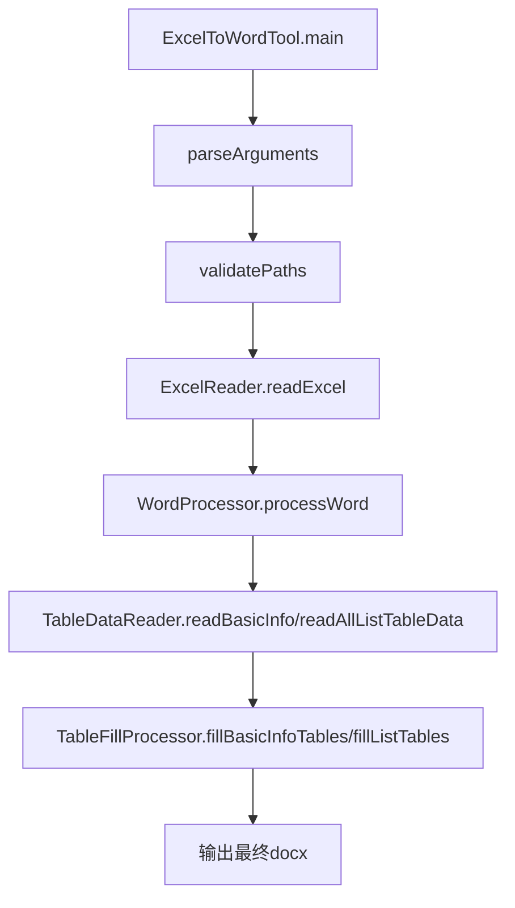

# Excel数据驱动Word文档自动生成工具 - 技术文档（核心代码报告）

## 1. 技术概览与完成度

本项目采用 **Java + Apache POI + Commons CLI + Spring Boot（测试上下文）** 实现。  
当前版本主流程已经完整可用：**读取 Excel → 解析模块数据 → 写入 Word 主体章节和测试用例表 → 填充附加表（基本信息/列表型）→ 输出文档**。

从工程实现角度，项目完成度可评估为：**约 85%（核心能力可交付，工程化能力仍有提升空间）**。

---

## 2. 架构与模块边界

```text
ExcelToWordTool (入口编排)
 ├─ ConfigLoader (参数与配置)
 ├─ ExcelReader (测试用例Sheet读取与分组)
 ├─ WordProcessor (章节扫描/子章节/测试用例表处理)
 ├─ TableDataReader (基本信息与列表型Sheet读取)
 └─ TableFillProcessor (附加表格填充)

RequirementManager / TraceabilityManager (需求与追溯能力)
SectionNumberUtil / FileUtil (工具支持)
```

模块分工上，入口类负责编排，Reader 负责输入解析，Processor 负责文档操作，Manager 负责需求与追溯领域能力。

---

## 3. 核心处理流程（代码级）



---

## 4. 核心代码报告（重点类与关键方法）

### 4.1 `ExcelToWordTool`（主入口）

- 文件：`/home/runner/work/DocAutoGenByExcel/DocAutoGenByExcel/src/main/java/pub/developers/docautogenbyexcel/ExcelToWordTool.java`
- 关键方法：
  - `main(String[] args)`：组织完整流程
  - `parseArguments(String[] args)`：命令行参数与配置文件双模式
  - `validatePaths(ConfigLoader config)`：输入输出路径校验
  - `processAdditionalTables(String excelPath, String outputPath)`：二次打开文档并填充附加表

**核心价值**：把“主表处理”和“附加表处理”拆成两段，降低耦合，便于定位问题。

---

### 4.2 `ExcelReader`（测试用例主数据读取）

- 文件：`/home/runner/work/DocAutoGenByExcel/DocAutoGenByExcel/src/main/java/pub/developers/docautogenbyexcel/reader/ExcelReader.java`
- 关键方法：
  - `readExcel(String excelPath)`：自动扫描所有 Sheet，查找包含 `模块编号` 的测试用例Sheet，并按模块分组
  - `readTestCase(...)`：将一行映射为 `TestCase`（动态列存入 `columnData`）

**核心逻辑要点**：
1. 通过配置中的必填列识别测试用例 Sheet，不依赖 sheet 名称
2. 非空行转换为 `TestCase`
3. 按 `moduleNumber` 聚合为 `Map<String, ModuleData>`

---

### 4.3 `WordProcessor`（文档主引擎）

- 文件：`/home/runner/work/DocAutoGenByExcel/DocAutoGenByExcel/src/main/java/pub/developers/docautogenbyexcel/processor/WordProcessor.java`
- 关键方法：
  - `processWord(...)`：文档处理总入口
  - `scanSections(...)`：扫描文档可用章节
  - `scanPlaceholders(...)`：扫描占位符章节
  - `processSection(...)`：处理单个模块章节，更新或新增子章节、Caption 和表格数据
  - `createSubSection(...)` / `createCaption(...)` / `insertNewTable(...)`：增量构造文档元素
  - `fillTableData(...)`：将 `TestCase` 列数据映射到目标表

**核心价值**：完成复杂的 Word 结构定位与增量写入，是项目“自动生成能力”的关键实现。

---

### 4.4 `TableDataReader`（附加表数据读取）

- 文件：`/home/runner/work/DocAutoGenByExcel/DocAutoGenByExcel/src/main/java/pub/developers/docautogenbyexcel/reader/TableDataReader.java`
- 关键方法：
  - `readBasicInfo(String excelPath)`：读取键值型表（表格名称/字段名/字段值）
  - `readAllListTableData(String excelPath)`：读取列表型表数据，自动跳过测试用例sheet和基本信息sheet

**核心价值**：将“主流程测试用例数据”与“补充表格数据”解耦，支持多类型表格统一入口读取。

---

### 4.5 `TableFillProcessor`（附加表填充引擎）

- 文件：`/home/runner/work/DocAutoGenByExcel/DocAutoGenByExcel/src/main/java/pub/developers/docautogenbyexcel/processor/TableFillProcessor.java`
- 关键方法：
  - `fillBasicInfoTables(...)`：按 Caption 匹配并填充键值型表
  - `fillListTables(...)`：按 Caption + 列名匹配填充列表表
  - `findTableCaption(...)`：在表格前文段中回溯 Caption
  - `findColumnIndex(...)`：列名模糊匹配

**核心价值**：把 Word 中“非测试用例主表”的通用填表逻辑沉淀成可复用处理器。

---

### 4.6 `RequirementManager` / `TraceabilityManager`（需求与追溯）

- 文件：
  - `/home/runner/work/DocAutoGenByExcel/DocAutoGenByExcel/src/main/java/pub/developers/docautogenbyexcel/manager/RequirementManager.java`
  - `/home/runner/work/DocAutoGenByExcel/DocAutoGenByExcel/src/main/java/pub/developers/docautogenbyexcel/manager/TraceabilityManager.java`
- 关键能力：
  - 需求树构建与自动分解（`autoDecomposeRequirement`）
  - 追溯关系建立（`establishTraceability`）
  - 覆盖率计算（`calculateCoverage`）
  - 追溯有效性验证（`validateTraceability`）

**核心价值**：在文档生成之外提供“需求工程能力”，提升工具的完整性与可扩展性。

---

## 5. 数据结构设计（核心模型）

- `ModuleData`：模块号 + 对应测试用例集合
- `TestCase`：主键字段 + 动态列数据（`LinkedHashMap` 保持顺序）
- `Requirement`：支持父子层级的需求实体
- `Traceability`：需求与测试用例关联关系

模型设计强调“动态列兼容”和“层级关系清晰”，适配不同模板与业务字段。

---

## 6. 测试与质量现状

当前已有测试：

- `DocAutoGenByExcelApplicationTests`
- `SectionNumberUtilTest`
- `RequirementTraceabilityTest`

从现有执行结果看，`mvn test` 可通过，需求/追溯能力与章节编号工具有覆盖。  
后续可优先补充 `WordProcessor`、`ExcelReader`、`TableFillProcessor` 的更细粒度单元测试。

---

## 7. 关键设计取舍与限制

1. **文件格式限制**：仅 `.xlsx` / `.docx`
2. **模板依赖样式**：章节和 Caption 识别依赖 Word 样式约定
3. **错误处理策略**：附加表处理异常当前为警告，不中断主流程
4. **列名匹配策略**：附加表填充支持模糊匹配，但仍建议保持模板列名规范

---

## 8. 扩展建议（面向后续版本）

1. 为文档处理链路增加结构化日志（阶段、模块号、表名、耗时）
2. 引入更完善的错误分级与失败报告
3. 加强核心处理器单元测试和样例回归测试
4. 支持更多模板定位方式（如书签/标记点）

---

## 9. 结论

项目当前已具备明确的生产可用主链路，能够完成“Excel驱动Word自动生成”的核心目标，  
并附带需求分解与追溯能力。若补齐测试粒度和工程化日志能力，可进一步提升可维护性与稳定性。
